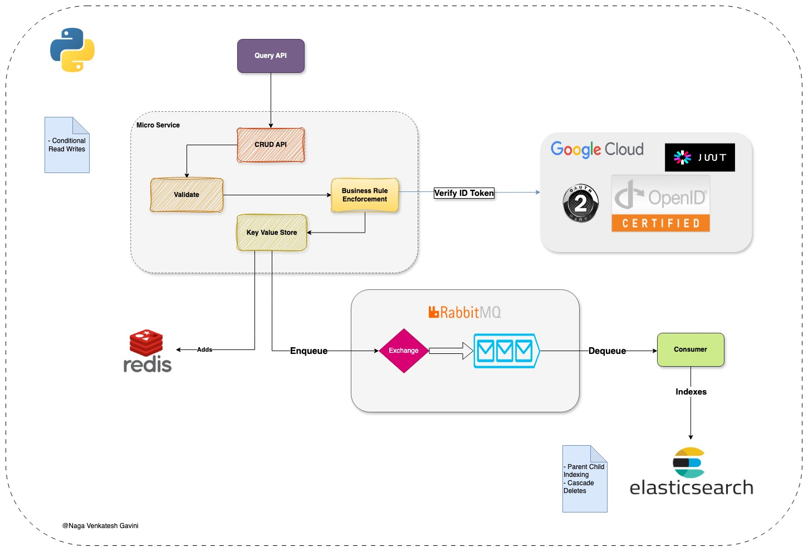

# Medical Plan RESTfull application

Project to demonstrate Indexing of Structured JSON objects

## Tech Stack
- Python Flask Microservice
- Redis Server
- ElasticSearch
- Kibana
- RabbitMQ
- Google IDP for OAUTH 2.0 Authentication
- Pydantic for Schema Validations
- REST Framework
- Postman

## Prerequisites:
  ```bash
  export GOOGLE_CLIENT_ID="rand-id.apps.googleusercontent.com"
  export RABBITMQ_HOST="localhost"
  export RABBITMQ_PORT="5672"
  export RABBITMQ_PASSWORD="guest"
  export RABBITMQ_USER="guest"
  export ES_PASSWORD="test@123"
  export ES_USER="elastic"
  export ES_HOST="localhost"
  export ES_PORT=9200
  ```

To generate Google Cliend Id and Secret, first needs to setup google consent from google console. Watch this video tutorial: https://www.youtube.com/watch?v=tgO_ADSvY1I

Tip: Env variables will be lost once you close the terminal, to fix that. Add the above commands to your `~/.zshrc` or `~/.bashrc`

## API Endpoints
- POST `/v1/plan` - Creates a new plan provided in the request body.
  - If the request is successful, a valid `Etag` for the object is returned in the `ETag` HTTP Response Header.
- GET `/v1/plan/{id}` - Fetches an existing plan provided by the id.
  - An Etag for the object can be provided in the If-None-Match HTTP Request Header.
  - Returns response only if data in db doesn't matches with the `Etag` provided in headers.
- DELETE `/v1/plan/{id}` - Deletes an existing plan provided by the id.
- PATCH `/v1/plan/{id}` - Update/merge an existing plan provided by the id.
  - A valid Etag for the object should also be provided in the `If-Match` HTTP Request Header.
  - The validator passes if the specified `ETag` matches that of the target resource.
  - The Controller updates only if there's a change in the client view of the response.

## Architecture Diagram:



## Run Details on Mac:
1. `brew install redis`
2. `brew services start redis`
3. `brew install rabbitmq`
4. `Run ElasticSearch & kibana locally in Docker` - https://www.elastic.co/guide/en/elasticsearch/reference/current/run-elasticsearch-locally.html
5. `python3 -m venv venv`
6. `source venv/bin/activate`
7. `pip install -r requirements.txt`
8. `python app.py`
9. `python consumer.py`

## Useful resources:
- https://blog.mimacom.com/parent-child-elasticsearch/
